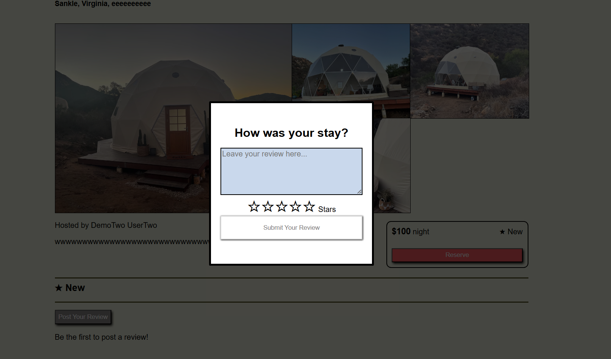

# Spirited Get Away

Spirited Get Away is a clone of the website Airbnb, an online market place that connects people who are looking for accomodations in a particular area with people who are renting out their properties. The backend of Spirited Get Away is built on sequelize with a PostgreSQL database. Frontend rendering is handled with React.
## How to clone

To clone this repo as `<new-project-name>`, run

```shell
git clone git@github.com:dianapnle/airbnb-demo.git <new-project-name>
```

in the directory where you want the new project to appear.

## How to install and run

Once the repo is cloned, run

`cd <new-project-name>`, then `cd backend && npm install` \
`cd <new-project-name>` then `cd frontend && npm install`

to install
dependencies.

To run the app, type `npm start` in the backend directory and `npm run dev` in the frontend directory.

## Features & Implementation

#### React router and components

Spirited Get Away is a single-page app. All “pages” are rendered at a root url “/”. The React router handles the logic associated with component navigation and updates accordingly to the root route. The child components are done through React.

#### Frontend and Backend Interaction

Spirited Get Away server is currently limited to posting data and modification of the database. The frontend stores retrieves and stores necessary information for rendering the site upon entry. There are seed data in the database which can be retrieved and modified, and new information can be passed to be stored into the database as well. The current application is limited to CRUD of spots and reviews. The backend has more functionalities with bookings and changes with updating spot images and review images but have not been implemented to interact with the frontend currently.

#### Authentication

Users of the site are required to sign up if they would like to post a review or create a new spot. Users can see spot details but will not see additional functionalities that include creating a spot or review. Upon account creation, the user passwords are hashed with B-crypt before being stored. Authentication uses B-crypt to match passwords which allow a user to login if the passwords match.

#### CRUD

##### Spots & Spot Images

Spots are the core of Spirited Get Away. All functionalities center around them. The spot table has columns for `ownerId, address, city, state, country, lat, lng, name, description, and price`. With the exception of the ownerId, all the other inputs are from the user. The owner_id is a foreign key that points to the associated owner.

Spots also have associations with spot images table. This table consists of
`spotId, url, and preview`. The url is a link to an image url for the spot and the preview is a boolean of true or false whether or not it should be the representative image displayed.

Spirited Get Away lets users create, read, update, and destroy spots. React components and functionalities have been implemented for each corresponding action in the app. Information needed for all components or users actions are managed with redux states.

Users can update the details of the spot that they own as well as delete it under a `manage your spots` link. The link has a list of spots that the user has made along with update or delete functionalities. Once an update or delete has been made:

Update:
1. An update spot form will appear with values pre-populated into the input boxes. Users can change details accordingly.
2. When user clicks update, a call is made to the backend to update the details in the database. Then, the store receives the spot's updated details, and then re-renders to display the spot's details and all associated current reviews.

Delete:
1. A user can delete a spot with a click of a button. This delete button will prompt the user to reconfirm if the user wants to delete the spot or not.
2. If no, the modal will close and the spot will remain under manage spots. If yes, there will be a call made to the backend to delete the spot. Once the store receives the changes in the user's spots, the manage spots browser will re-render and remove the spot that was just deleted and close the modal.

##### Reviews

Spirited Get Away also lets users review other spots that they do not own. Posting a review is as easy as clicking a button that opens a modal with a text box for description and a star rating that adjusts with the hover of the user's mouse.

Example Create Review


Once a review has been made, the review is quickly added under the spot's details without refreshing. It is done by the following:

1. After the review has been made, two calls are made to get the spot's details and current reviews corresponding to the spot.
2. When the store receives the spot's updated details and reviews, it then re-renders to display the spot's details and all current reviews.

#### New Features Queue

Some features missing from this current app that will hopefully be implemented at a future date:

- CRUD bookings
- CRUD spot images and review images
- Implementation of google maps API
